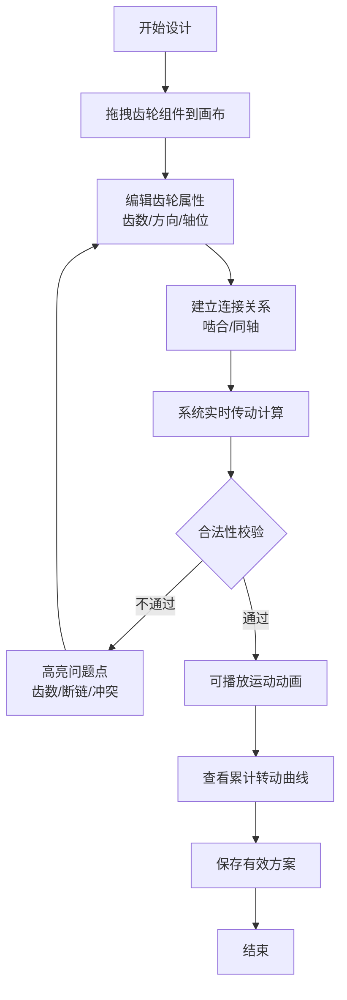

## 1. 产品概述
面向机械天球仪模型爱好者的齿轮排布与运动推演工具，通过可视化交互界面帮助用户设计齿轮传动系统，实时验证传动逻辑并推演长期运动轨迹。
- 目标用户：机械天球仪模型制作者、齿轮传动爱好者、教学演示场景
- 核心价值：将抽象的齿轮传动关系可视化，降低设计门槛，提前发现传动冲突

## 2. 核心功能

### 2.1 用户角色
| 角色 | 注册方式 | 核心权限 |
|------|----------|----------|
| 普通用户 | 无需注册，本地使用 | 创建/编辑齿轮方案、实时推演、保存/加载方案 |

### 2.2 功能模块
1. **齿轮关系图画布**：可拖拽的 SVG 画布，支持放置太阳轮、行星轮、传动轴，支持平移缩放
2. **齿轮属性面板**：编辑齿数、初始角度、旋转方向，建立啮合/同轴连接关系
3. **实时运动演示**：动画演示齿轮转动，展示角位移变化与传动方向
4. **累计转动曲线**：以 D3.js 绘制一天/一年周期内各齿轮的累计转角曲线
5. **传动验证系统**：齿数合法性校验、同轴冲突检测、断链高亮、自锁/方向冲突检测
6. **方案管理**：保存/加载方案，无效方案禁止保存

### 2.3 页面详情
| 页面名称 | 模块名称 | 功能描述 |
|----------|----------|----------|
| 主工作台 | 顶部工具栏 | 新建/保存/加载方案、播放/暂停动画、时间尺度调节 |
| 主工作台 | 左侧组件面板 | 齿轮组件库（太阳轮、行星轮、传动轴），拖拽添加到画布 |
| 主工作台 | 中央画布区 | D3.js 可拖拽齿轮关系图，支持节点拖拽、连线建立啮合 |
| 主工作台 | 右侧属性面板 | 选中齿轮的属性编辑（齿数、方向、轴位），实时显示传动比 |
| 主工作台 | 底部曲线图 | 累计转动曲线图表，支持切换日/年周期，多齿轮对比 |

## 3. 核心流程

用户从组件库拖拽齿轮到画布 → 设置齿轮属性（齿数、方向、轴位）→ 建立啮合/同轴关系 → 系统实时计算传动链 → 验证合法性并高亮问题 → 播放动画观察运动 → 查看累计曲线 → 验证通过后保存方案

## 4. 用户界面设计

### 4.1 设计风格
- **设计主题**：工业机械风，深色主题为主，配合金属质感的齿轮视觉
- **主色调**：深灰蓝 (#1a1f2e) 背景，铜橙色 (#d4753c) 作为主强调色，钢青色 (#4a90a4) 作为辅助色
- **齿轮样式**：金属渐变填充，齿廓清晰，选中态带发光描边
- **字体**：标题使用 Orbitron（科技感），正文使用 Roboto Mono（等宽数字清晰）
- **布局风格**：三栏布局（左组件库 + 中画布 + 右属性面板），底部图表区可折叠

### 4.2 页面设计概述
| 页面名称 | 模块名称 | UI 元素 |
|----------|----------|---------|
| 主工作台 | 顶部工具栏 | 深色毛玻璃背景，图标按钮带 hover 微动效，播放按钮用铜橙色突出 |
| 主工作台 | 组件面板 | 卡片式齿轮预览，拖拽时光标变化，卡片悬浮有阴影上浮效果 |
| 主工作台 | 画布区 | 深色网格背景，齿轮节点带金属质感，连线有方向箭头，断链用红色虚线闪烁 |
| 主工作台 | 属性面板 | 分组表单，数值输入带步进器，实时计算结果用高亮色块展示 |
| 主工作台 | 曲线图 | 深色背景配彩色曲线，hover 显示数据点，图例可切换显隐 |

### 4.3 响应性
- 桌面端优先（1440px 以上），三栏完整布局
- 中等屏幕（1024-1440px）保持三栏，适当压缩面板宽度
- 小屏（768-1024px）采用上下布局，组件面板收纳为顶部工具栏
- 触控优化：齿轮拖拽有明显吸附反馈，双击打开属性

### 4.4 交互动效
- 齿轮拖拽：带阴影跟随，吸附到网格点时有轻微弹跳
- 建立啮合：从齿轮边缘拉出连线，吸附到目标齿轮时高亮
- 播放动画：齿轮平滑旋转，啮合点有火花粒子效果
- 错误提示：问题齿轮红色脉动，连线断点处有闪烁箭头
- 曲线绘制：页面加载时曲线从左到右描边动画
