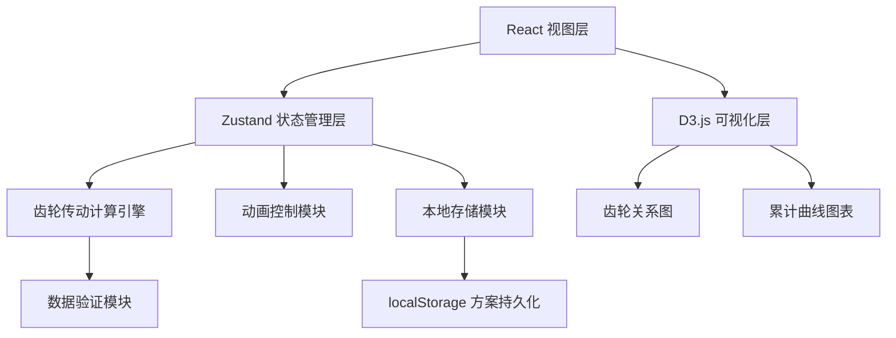
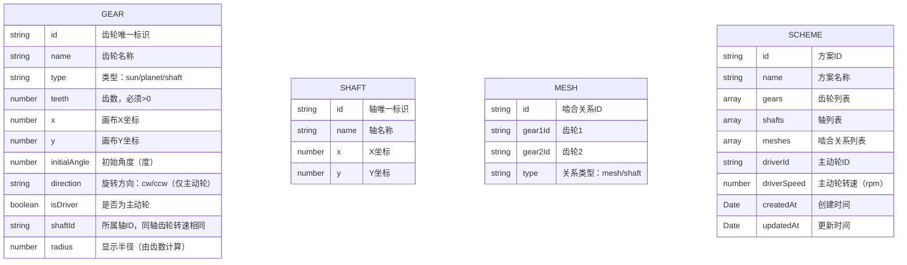

## 1. 架构设计



## 2. 技术描述

- **前端框架**：React@18 + TypeScript + Vite@5
- **UI 组件库**：Mantine v7（提供表单、按钮、布局面板等组件）
- **可视化引擎**：D3.js v7（齿轮关系图拖拽、累计曲线绘制）
- **状态管理**：Zustand（轻量级状态管理，管理齿轮数据和动画状态）
- **样式方案**：Mantine 内置 CSS-in-JS + 自定义 CSS 变量
- **图标库**：lucide-react
- **数据持久化**：localStorage 本地存储方案数据

## 3. 路由定义
| 路由 | 用途 |
|------|------|
| / | 主工作台（齿轮设计 + 动画演示 + 曲线图表） |

## 4. 数据模型

### 4.1 齿轮节点数据模型



### 4.2 TypeScript 类型定义

```typescript
type GearType = 'sun' | 'planet' | 'shaft';
type RotationDirection = 'cw' | 'ccw';
type MeshType = 'mesh' | 'shaft';

interface Gear {
  id: string;
  name: string;
  type: GearType;
  teeth: number;
  x: number;
  y: number;
  initialAngle: number;
  direction: RotationDirection;
  isDriver: boolean;
  shaftId?: string;
  color?: string;
}

interface Shaft {
  id: string;
  name: string;
  x: number;
  y: number;
}

interface MeshRelation {
  id: string;
  sourceId: string;
  targetId: string;
  type: MeshType;
}

interface GearState {
  gearId: string;
  angularVelocity: number; // rad/s
  direction: RotationDirection;
  currentAngle: number; // 当前累计角度（度）
  isValid: boolean;
}

interface ValidationResult {
  isValid: boolean;
  errors: ValidationError[];
}

interface ValidationError {
  type: 'teeth_invalid' | 'shaft_conflict' | 'chain_broken' | 'self_lock' | 'direction_conflict';
  gearIds: string[];
  message: string;
}

interface Scheme {
  id: string;
  name: string;
  gears: Gear[];
  shafts: Shaft[];
  meshes: MeshRelation[];
  driverId: string;
  driverSpeed: number; // rpm
  createdAt: number;
  updatedAt: number;
}
```

## 5. 核心模块设计

### 5.1 齿轮传动计算引擎
- **输入**：齿轮列表、啮合关系、主动轮参数
- **输出**：各齿轮的角速度、旋转方向、累计转角
- **算法**：
  1. 构建邻接表表示齿轮传动图
  2. 从主动轮开始 BFS 遍历传动链
  3. 啮合传动：转速比 = 齿数反比，方向反转
  4. 同轴传动：转速相同，方向相同
  5. 检测方向冲突：同一齿轮收到两个不同方向的传动
  6. 检测断链：未被遍历到的齿轮

### 5.2 验证模块
- **齿数验证**：所有齿轮齿数 > 0
- **同轴冲突**：同一轴上有两个及以上主动轮
- **断链检测**：从主动轮无法到达的齿轮
- **方向冲突**：传动链中出现矛盾的旋转方向
- **自锁检测**：蜗轮蜗杆或特定传动比导致的理论自锁

### 5.3 动画模块
- 使用 requestAnimationFrame 驱动
- 时间缩放系数可调（1x/10x/100x/1000x）
- 支持播放/暂停/重置
- 实时计算各齿轮当前角度

### 5.4 累计曲线模块
- 预计算一天/一年的各齿轮累计转角
- D3.js 绘制多折线图
- 支持悬停查看具体数值
- 支持切换时间周期（日/年）

## 6. 项目目录结构

```
src/
├── components/
│   ├── Toolbar/           # 顶部工具栏
│   ├── ComponentPanel/    # 左侧组件库面板
│   ├── GearCanvas/        # 中央齿轮画布（D3.js）
│   │   ├── GearNode.tsx   # 单个齿轮节点
│   │   ├── MeshLink.tsx   # 啮合连线
│   │   └── index.tsx
│   ├── PropertyPanel/     # 右侧属性面板
│   ├── CurveChart/        # 底部累计曲线图表
│   └── common/            # 通用组件
├── store/
│   └── useGearStore.ts    # Zustand 状态管理
├── engine/
│   ├── transmission.ts    # 传动计算引擎
│   └── validation.ts      # 验证模块
├── hooks/
│   ├── useAnimation.ts    # 动画 hook
│   └── useD3Canvas.ts     # D3 画布 hook
├── types/
│   └── index.ts           # TypeScript 类型定义
├── utils/
│   ├── gearMath.ts        # 齿轮数学计算
│   └── storage.ts         # 本地存储工具
├── pages/
│   └── Workbench.tsx      # 主工作台页面
├── App.tsx
├── main.tsx
└── index.css
```
